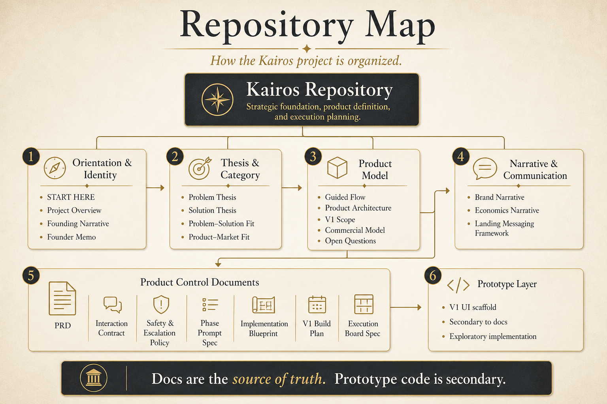

# Kairos

Kairos is a project about guided spiritual discernment for important decisions.

Start here:

- [START HERE](docs/START-HERE.md)

This repository is being organized around the foundations first:

- what problem Kairos exists to solve
- what solution thesis it proposes
- how the process works phase by phase
- where the initial product and business hypotheses come from

## Repository map

### Orientation and identity

- [Project Overview](docs/00-project-overview.md)
- [Founding Narrative](docs/10-founding-narrative.md)
- [Founder Memo](docs/13-founder-memo.md)

### Thesis and category

- [Problem Thesis](docs/01-problem-thesis.md)
- [Solution Thesis](docs/02-solution-thesis.md)
- [Problem–Solution Fit](docs/03-problem-solution-fit.md)
- [Product–Market Fit](docs/04-product-market-fit.md)

### Product model

- [Guided Flow](docs/05-guided-flow.md)
- [Product Architecture](docs/06-product-architecture.md)
- [V1 Scope](docs/07-v1-scope.md)
- [Commercial Model](docs/08-commercial-model.md)
- [Open Questions](docs/09-open-questions.md)

### Narrative and market-facing communication

- [Brand Narrative](docs/11-brand-narrative.md)
- [Economics Narrative](docs/12-economics-narrative.md)
- [Landing Messaging Framework](docs/14-landing-messaging-framework.md)

### Product control documents

- [Product Requirements Document](docs/prd/product-requirements-document.md)
- [Interaction Contract](docs/prd/interaction-contract.md)
- [Spiritual Safety & Escalation Policy](docs/prd/spiritual-safety-and-escalation-policy.md)
- [Phase Prompt Spec](docs/prd/phase-prompt-spec.md)
- [Implementation Blueprint](docs/prd/implementation-blueprint.md)
- [V1 Build Plan](docs/prd/v1-build-plan.md)
- [Execution Board Spec](docs/prd/execution-board-spec.md)

## Current state

The source of truth for this stage is the documentation in `docs/`.

There is an early implementation scaffold, but it has been intentionally moved out of the repository root:

- [Prototype V1 UI](prototypes/v1-ui)

That prototype is exploratory and secondary. It does not define the project. The project is currently being defined through documentation first.
