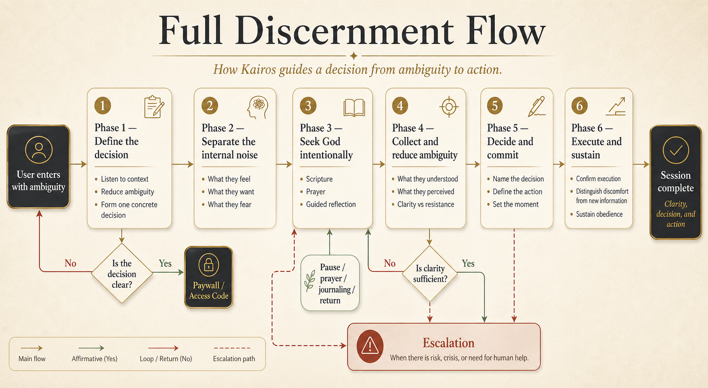
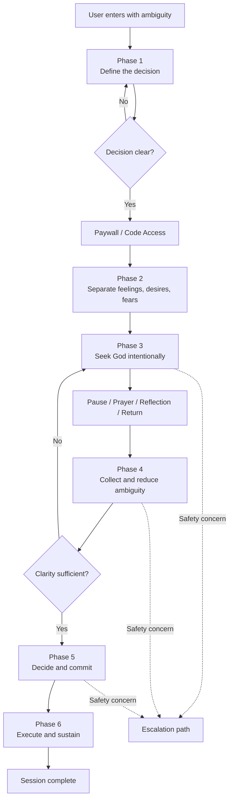

# Guided Flow

This document captures the six-phase flow currently defined for Kairos at the conceptual level.

## Visual flow

## Phase 1 — Define the decision

### Objective

Convert a vague, emotional, divergent description into one concrete decision.

### What happens

- the user arrives with ambiguity
- Kairos listens first
- Kairos refuses to treat feelings as the decision
- after one or more attempts, Kairos proposes possible decision formulations
- the user confirms the correct formulation

### Success condition

A decision is named clearly, concretely, and actionably.

Example:

`Should I end this relationship or continue in it?`

---

## Phase 2 — Separate the internal noise

### Objective

Expose what is happening inside the person so it stops ruling invisibly.

### What happens

- the user names what they feel
- the user names what they want
- the user names what they fear
- Kairos helps separate categories when they are mixed
- Kairos clarifies that these elements are real, but not decisive

### Success condition

Emotion, desire, and fear become visible and distinct.

---

## Phase 3 — Seek God intentionally

### Objective

Move from reflection alone into directed spiritual search.

### What happens

- the mode shifts from analysis to seeking
- Kairos directs the user into Scripture through a relevant lens
- the user reads, reflects, and prays specifically
- Kairos uses questions to reduce vague spiritual language
- the user is given a pause, not a rushed answer
- intercession and spiritual companionship may be introduced

### Success condition

The user genuinely engages with Scripture and prayer around the actual decision.

---

## Phase 4 — Collect and reduce ambiguity

### Objective

Turn spiritual experience into usable clarity without inventing an answer.

### What happens

- the user reports what they understood
- the user reports what they sensed in prayer
- Kairos separates clarity from emotional resistance
- Kairos proposes clear formulations when the user remains diffuse

### Success condition

The user can identify whether:

- clarity is emerging
- more seeking is needed
- the real problem is resistance, not confusion

---

## Phase 5 — Decide and commit

### Objective

Convert clarity into a concrete decision and a defined action.

### What happens

- the user states the decision explicitly
- Kairos checks for alignment with what the user says they received
- the user names a concrete next action
- the user fixes a moment in time for execution

### Success condition

The user leaves with a real decision and a real next step.

---

## Phase 6 — Execute and sustain

### Objective

Ensure that the decision enters reality and is not undone by later discomfort.

### What happens

- the user confirms whether the action happened
- Kairos distinguishes new information from emotional reversal
- the decision is not casually reopened
- the person reflects on what execution exposed or confirmed

### Success condition

The user not only decides, but acts and remains steady.

## Continue reading

- [Back to START HERE](START-HERE.md)
- Previous: [Product–Market Fit](04-product-market-fit.md)
- Next: [Product Architecture](06-product-architecture.md)
