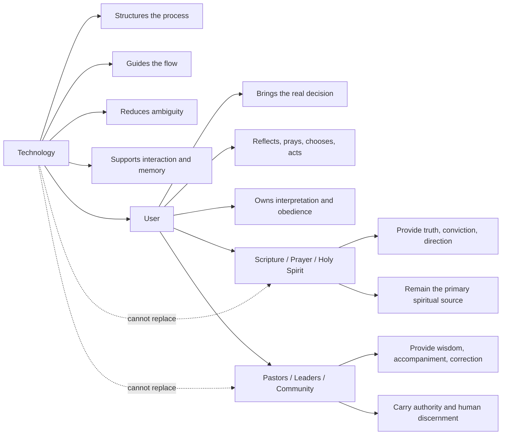

# Founding Narrative

## Why Kairos

`Kairos` comes from the Greek idea of the decisive moment, the opportune moment, the moment charged with meaning.

It is not merely time as sequence.

It is time as significance.

It is the moment in which something must be recognized, answered, obeyed, or acted upon.

This name matters because Kairos is not fundamentally about information.

It is about decision.

It is about the human moment in which clarity, obedience, consequence, and direction meet.

Many people live in `chronos`: time passing, days accumulating, decisions delayed, ambiguity prolonged.

Kairos exists for `kairos`: the moment in which a person must stop drifting and respond faithfully to what is becoming clear before God.

## The spiritual meaning of the project

Kairos begins with a conviction:

life is full of decisions, and decisions are deeply spiritual.

Not because every decision is mystical.

But because decisions reveal:

- what we believe
- what we fear
- what we love
- what we obey
- who we are becoming

Important decisions are never merely operational.

They shape direction, relationships, stewardship, calling, and character.

For that reason, discernment is not a luxury inside spiritual life.

It is central to spiritual life.

## The problem Kairos recognizes

People often already have access to prayer, Scripture, community, and wise counsel.

The problem is not necessarily the absence of spiritual source.

The problem is that many people still do not have a clear, disciplined, repeatable way to move from:

- inner noise
- emotional pressure
- partial clarity
- spiritual language

toward:

- one real decision
- one obedient next step
- one action that enters reality

Kairos exists inside that gap.

## The category Kairos is creating

Kairos does not fit naturally inside existing product categories.

It is not:

- a devotional app
- a Christian content product
- a generic AI companion
- a counseling marketplace
- a note-taking tool for spiritual reflection

Kairos belongs to a category of its own:

guided spiritual discernment for important decisions.

Its value is not based on content consumption.

Its value is based on helping a person close a decision with clarity and obedience.

That category is unusually powerful because decisions are everywhere.

Not dozens of them.

Thousands of them.

And every meaningful life journey is shaped by accumulated decisions.

Kairos is built around the conviction that helping people make better, clearer, more obedient decisions is not a marginal service.

It is a foundational service.

## A unique value narrative

The core value narrative of Kairos is simple and unique:

Kairos helps a person organize what they already believe God is showing them until it becomes a clear and executable decision.

That is not the same as:

- “getting advice”
- “consuming encouragement”
- “chatting with AI”
- “receiving content”

Kairos exists to facilitate decisions.

Not abstract inspiration.

Not passive learning.

Decisions.

That matters because a single good decision can change:

- a relationship
- a career path
- a ministry direction
- a financial future
- a family system

And if Kairos can help facilitate not one decision, but thousands of decisions, then it is participating in something profoundly practical and deeply spiritual at the same time.

## The frontier between technology and God

Kairos depends on a very special boundary.

## Boundary map

Technology is capable of extraordinary things.

Technology can help with:

- systems
- process design
- flow control
- memory
- sequencing
- reasoning structure
- interaction design
- natural language guidance
- ambiguity reduction
- digital distribution at scale

Technology can organize.

Technology can guide.

Technology can structure.

Technology can help a person stay inside a process long enough to reach clarity.

But technology cannot do what belongs to God.

Technology cannot replace:

- the voice of God
- the work of the Holy Spirit
- the authority of Scripture
- the role of pastors, leaders, teachers, evangelists, and trusted believers
- the living wisdom of a community of faith

Kairos is built on the conviction that each of these domains does its own work well.

Technology should not try to become God.

It should do its own work faithfully.

And when technology does its work well, it can optimize the human process around discernment without claiming ownership over revelation, truth, or spiritual authority.

That boundary is not a limitation.

It is part of the beauty of Kairos.

## Why this is spiritual and commercial at the same time

Kairos rejects the false idea that something stops being spiritual when it touches money.

Business is not outside spiritual life.

Business is one of the places where spiritual life becomes visible.

How we create value, how we price value, how we treat people, how we serve, how we steward, how we grow, and how we build all carry spiritual meaning.

In that sense, business is a spiritual game.

Not because business is vague or mystical.

But because business reveals:

- stewardship
- integrity
- service
- justice
- generosity
- responsibility

Kairos is not ashamed of being a business.

Kairos intends to create real value, charge for that value, and generate wealth through that value.

That is not a corruption of the vision.

That is one expression of the vision.

## Value and price

If Kairos helps someone close an important decision, the value is real.

If that value is real, pricing it is legitimate.

If many people need that value, scale is legitimate.

If scale produces significant revenue, wealth creation is legitimate.

The spiritual question is not whether money is present.

The spiritual question is whether value is real, treatment is just, and stewardship is faithful.

Kairos is built on the belief that a person can pay:

- 9 dollars for a decision
- or a lower unit cost through a pack

and receive something meaningful enough that the exchange is not manipulative but honorable.

If that happens thousands of times, Kairos becomes both:

- a vehicle of help
- a vehicle of wealth creation

The business grows because value grows.

## A biblical frame for enterprise

Kairos also stands inside a larger biblical vision of work, stewardship, and cultivation.

The project is not imagining business as something spiritually suspect.

It sees enterprise as something that can participate in:

- cultivation
- multiplication
- stewardship
- service
- responsibility

From the beginning, humanity was not only called to contemplation, but also to stewardship and ordering.

The work of shaping, naming, cultivating, organizing, and bringing order into the world is part of the human commission.

Kairos sees itself inside that broader pattern.

It is not merely building software.

It is attempting to cultivate a category of service that helps human beings act with greater clarity, obedience, and responsibility.

## The deeper ambition

The ambition of Kairos is not only to build a tool.

It is to establish a new kind of trust category:

a system that helps people make important decisions before God without pretending to be God.

That is rare.

And if done well, it has unusual power.

Because it can serve:

- individuals
- marriages
- leaders
- churches
- ministries
- communities of faith

It can serve the private moment of uncertainty and the public need for wise action.

## What Kairos ultimately wants to become

Kairos wants to become a trusted structure around important decisions.

It wants to be known for this:

when someone is stuck between what they feel, what they fear, and what they believe God is showing them, Kairos helps them move toward clarity and action.

That is the essence.

Not automation for its own sake.

Not AI spectacle.

Not religious content.

Clarity.
Decision.
Obedience.
Action.

## Final declaration

Kairos exists for the moment that matters.

It exists because decisions matter.

It exists because spiritual life must enter real life.

It exists because technology can serve discernment without replacing God.

It exists because value can be spiritual and commercial at the same time.

It exists because helping people make better decisions is a real form of service.

And if that service reaches thousands of people and becomes thousands of decisions and thousands of dollars, that does not reduce its meaning.

It proves its value.
