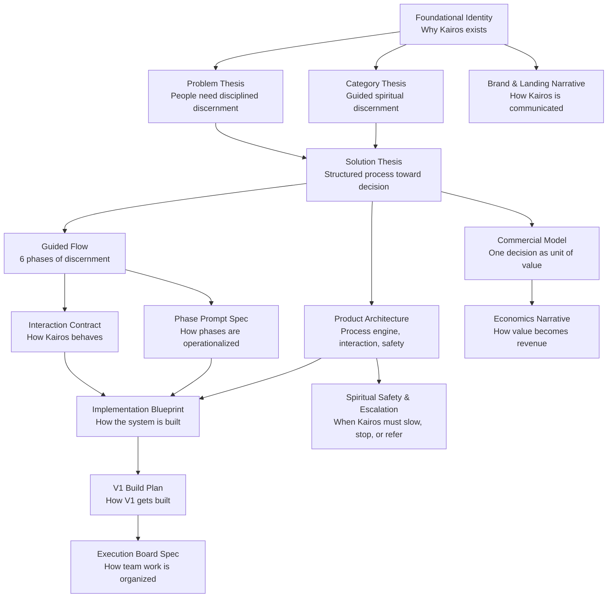

# START HERE

## What this repository is

This repository is the strategic foundation of `Kairos`.

Kairos is a guided spiritual discernment project for important decisions.

It is being built around a simple but ambitious conviction:

helping people decide well before God is both a meaningful service and a real business category.

This repository is not primarily a codebase yet.

At this stage, it is the structured thinking system behind the project.

## Visual map

## What Kairos is trying to do

Kairos exists to help a person move from:

- ambiguity
- internal noise
- spiritual hesitation

toward:

- a clear decision
- a concrete next step
- real follow-through

It does this without replacing:

- God
- the Holy Spirit
- Scripture
- pastors, leaders, and trusted human guidance

Kairos is built on the boundary that technology can guide process, but cannot become spiritual authority.

## What stage the project is in

Kairos is currently in a `pre-product build readiness` stage.

That means:

- the project is no longer just an inspiring idea
- the category, thesis, product logic, and safety boundaries are now documented
- the repository is ready for serious, directed implementation work
- the team should not improvise the product from scratch anymore

This is the phase where foundations are strong enough to support execution.

## What is already resolved

The repository already contains strong working positions on:

- the meaning of Kairos and the founding narrative
- the problem and solution thesis
- problem–solution fit
- product–market fit
- the guided six-phase flow
- product architecture
- V1 scope
- business model and economics
- brand narrative
- spiritual safety and escalation
- interaction contract
- phase prompting logic
- implementation blueprint

In other words:

the project already knows what it is, why it matters, how it should behave, how it should protect users, and how it can begin to be built.

## What is not resolved yet

This repository does not yet represent:

- final production architecture
- final design system
- final go-to-market assets
- full theological edge-case handling
- full implementation of the V1 product

Some implementation scaffolding exists, but it is secondary and exploratory.

## How to read this repository

If you are new to Kairos, read in this order:

### 1. Orientation

- [Project Overview](/Users/juanvillalba/Documents/kairos/docs/00-project-overview.md)
- [Founding Narrative](/Users/juanvillalba/Documents/kairos/docs/10-founding-narrative.md)
- [Founder Memo](/Users/juanvillalba/Documents/kairos/docs/13-founder-memo.md)

### 2. Core thesis

- [Problem Thesis](/Users/juanvillalba/Documents/kairos/docs/01-problem-thesis.md)
- [Solution Thesis](/Users/juanvillalba/Documents/kairos/docs/02-solution-thesis.md)
- [Problem–Solution Fit](/Users/juanvillalba/Documents/kairos/docs/03-problem-solution-fit.md)
- [Product–Market Fit](/Users/juanvillalba/Documents/kairos/docs/04-product-market-fit.md)

### 3. Product model

- [Guided Flow](/Users/juanvillalba/Documents/kairos/docs/05-guided-flow.md)
- [Product Architecture](/Users/juanvillalba/Documents/kairos/docs/06-product-architecture.md)
- [V1 Scope](/Users/juanvillalba/Documents/kairos/docs/07-v1-scope.md)
- [Commercial Model](/Users/juanvillalba/Documents/kairos/docs/08-commercial-model.md)
- [Economics Narrative](/Users/juanvillalba/Documents/kairos/docs/12-economics-narrative.md)

### 4. Product requirements and controls

- [Product Requirements Document](/Users/juanvillalba/Documents/kairos/docs/prd/product-requirements-document.md)
- [Interaction Contract](/Users/juanvillalba/Documents/kairos/docs/prd/interaction-contract.md)
- [Spiritual Safety & Escalation Policy](/Users/juanvillalba/Documents/kairos/docs/prd/spiritual-safety-and-escalation-policy.md)
- [Phase Prompt Spec](/Users/juanvillalba/Documents/kairos/docs/prd/phase-prompt-spec.md)
- [Implementation Blueprint](/Users/juanvillalba/Documents/kairos/docs/prd/implementation-blueprint.md)

### 5. Communication layer

- [Brand Narrative](/Users/juanvillalba/Documents/kairos/docs/11-brand-narrative.md)
- [Landing Messaging Framework](/Users/juanvillalba/Documents/kairos/docs/14-landing-messaging-framework.md)

### 6. Execution layer

- [V1 Build Plan](/Users/juanvillalba/Documents/kairos/docs/prd/v1-build-plan.md)
- [Execution Board Spec](/Users/juanvillalba/Documents/kairos/docs/prd/execution-board-spec.md)
- [Open Questions](/Users/juanvillalba/Documents/kairos/docs/09-open-questions.md)

## How to use this repository as a team

Use this repository to:

- align on what Kairos is
- avoid rebuilding the concept from scratch in every conversation
- protect the project from shallow execution
- preserve the spiritual and strategic boundaries of the product
- translate the vision into implementation with discipline

Do not use this repository to:

- improvise theology
- bypass the documented interaction model
- turn Kairos into a generic chatbot
- flatten the spiritual seriousness of the category

## Current structural principle

At this moment, `docs/` is the source of truth.

The prototype code in:

- [Prototype V1 UI](/Users/juanvillalba/Documents/kairos/prototypes/v1-ui)

is secondary.

It may inform implementation, but it does not define the project.

## What should happen next

The next phase of work should likely focus on one of these tracks:

1. implementation planning and execution
2. landing and communication assets
3. validation planning with real users and communities

The project has enough conceptual strength to begin building seriously.

The main risk now is not lack of ideas.

The main risk is losing discipline in translation.

## Final note

If you are entering this repository, understand this:

Kairos is not trying to build another Christian app.

Kairos is trying to build a new category around one of the most important realities in life:

the moment of decision.
